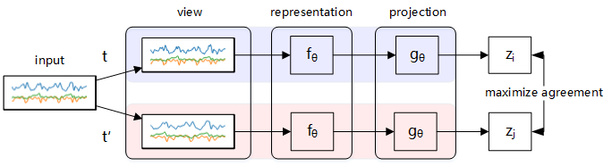
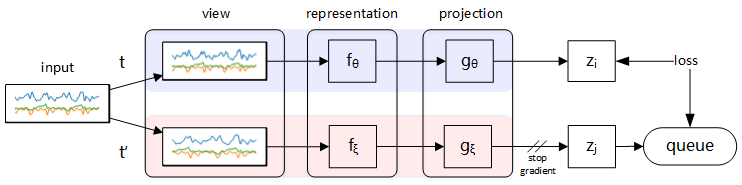

# Sensor Data Augmentation by Resampling for Contrastive Learning in Human Activity Recognition

To address the problem that human activity recognition based on sensor data performs poorly in the contrastive learning framework, we propose resampling data augmentation and adapting MoCo as a contrastive learning framework for HAR



<center>SimCLRHAR</center>



<center>MoCoHAR</center>

More details can be found in our paper: https://arxiv.org/abs/2109.02054

This repository presents some implementation details of the paper and the code runtime environment

## Requirements

This project code is done in Python 3.7 and third party libraries. 

 TensorFlow 2.x is used as a deep learning framework.

The main third-party libraries used and the corresponding versions are as follows:

+ tensorflow 2.3.1

+ tensorflow_addons 0.15.0

+ numpy 1.18.5

+ scipy 1.5.0

+ scikit-learn 0.23.1

+ matplotlib 3.3.4

  

## Running

This demo can be run with the following command:

```shell
python SimCLRHAR.py
```

```shell
python MoCoHAR.py
```

## Code Organisation

The main content of each file is marked as follows:

+ Augment.py: This file contains a variety of sensor data augmentation methods.
+ DeepConvLSTM.py: This file contains the network structure of DeepConvLSTM
+ MoCoHAR.py: This file contains the details of MoCoHAR and the methods how it works.
+ SimCLRHAR.py: This file contains the details of SimCLRHAR and the methods how it works.

## Citation

If you find our paper useful or use the code available in this repository in your research, please consider citing our work:

```
@ARTICLE{9925142,
  author={Wang, Jinqiang and Zhu, Tao and Gan, Jingyuan and Chen, Liming Luke and Ning, Huansheng and Wan, Yaping},
  journal={IEEE Sensors Journal}, 
  title={Sensor Data Augmentation by Resampling in Contrastive Learning for Human Activity Recognition}, 
  year={2022},
  volume={22},
  number={23},
  pages={22994-23008},
  doi={10.1109/JSEN.2022.3214198}}
```

## Reference

+ https://github.com/iantangc/ContrastiveLearningHAR

+ https://github.com/google-research/simclr.
+ https://github.com/PaperCodeReview/MoCo-TF
